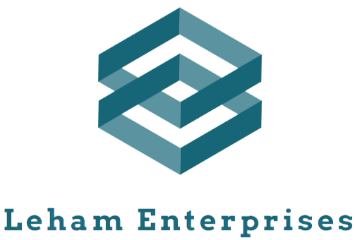

# Projeto Integrador

Projeto desenvolvido pela empresa Leham Enterprises, onde a Atlantis Scervino Sustentáveis LTDA, por intermédio do SENAI Jandira, nos contratou para realizarmos uma branding page,divulgando a marca e recrutando novos colaboradores

&

---

## Objetivo
Recrutamento e marketing da empresa e suas qualidades dentro do meio corporativo, além de mostrar as qualidades de se tornar um colaborador Scervino, 

---
## Integrantes
Antony Gabriel - Gerente de UX Design 
*(Realizou uma parte do Figma e o footer)*

Melissa Victória - Supervisora de UI Design
*(Realizou uma parte do Figma e as páginas Sobre nós e Fundadores)*

Leonel Ramos - Líder de um grupo de desenvolvedores *(Realizou uma parte do Figma e a página Benefícios e Cpacitação Técnica)*

Heitor Pontieri - Diretor Geral do projeto 
*(Realizou uma parte do Figmam, as páginas home e as header do site e a página Fundadores)*

---
## Tecnologias usadas

- HTML 5
- CSS 3
- Figma

---
## Links Importantes

-[Site Online](heitorpontieri.github.io/lehamscervino/)

-[Protótipo realizado no site Figma, que é especializado em Web Design](https://www.figma.com/file/Ft9Zl4jnqNn8ynhsY77A3i/Scervino-Project?node-id=0%3A1)

-[Repositório no Github que é uma rede social para desenvolvedores](https://github.com/HeitorPontieri/LehamScervino)

